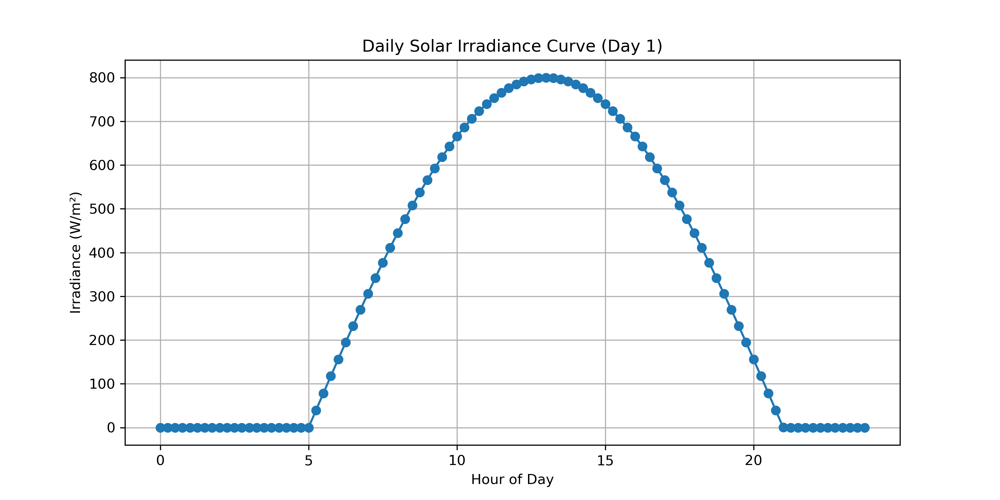
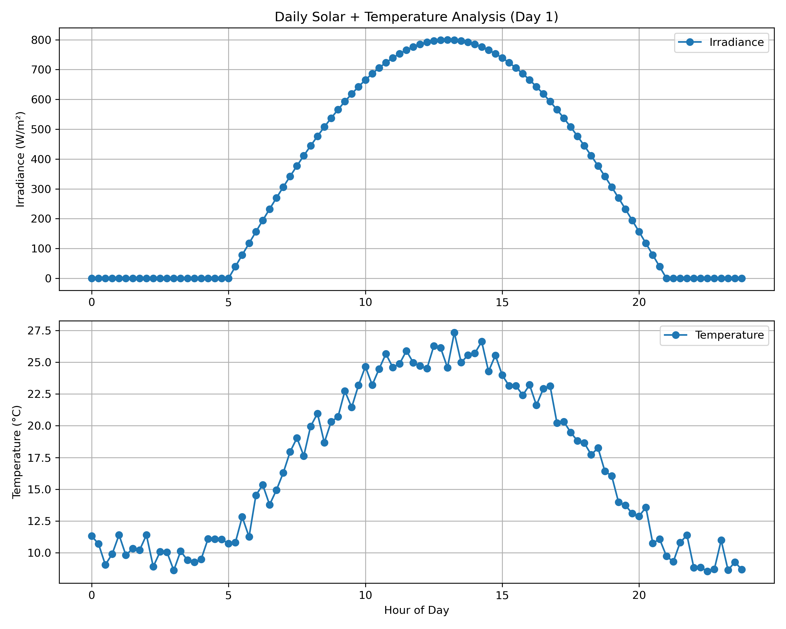
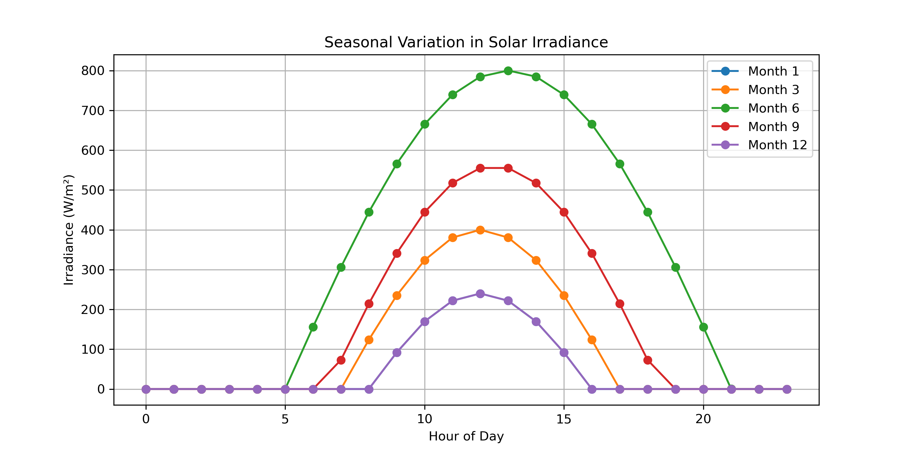
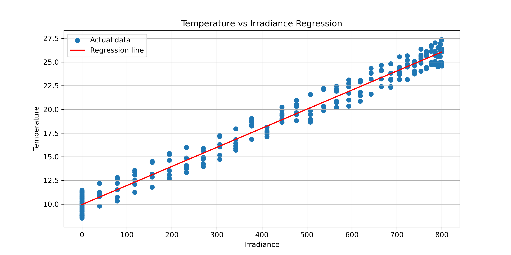
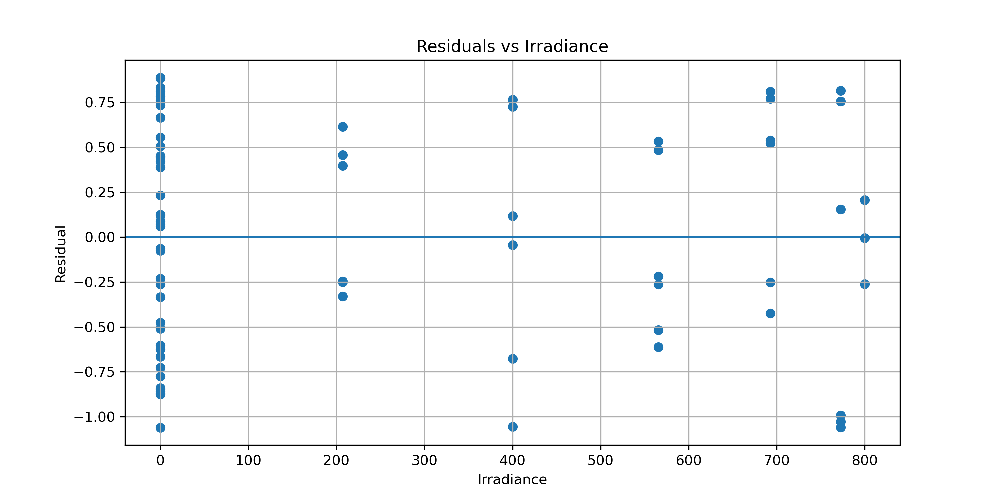
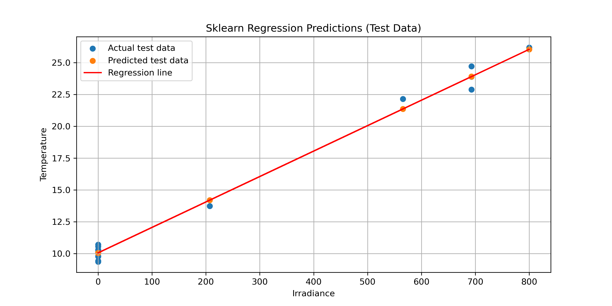
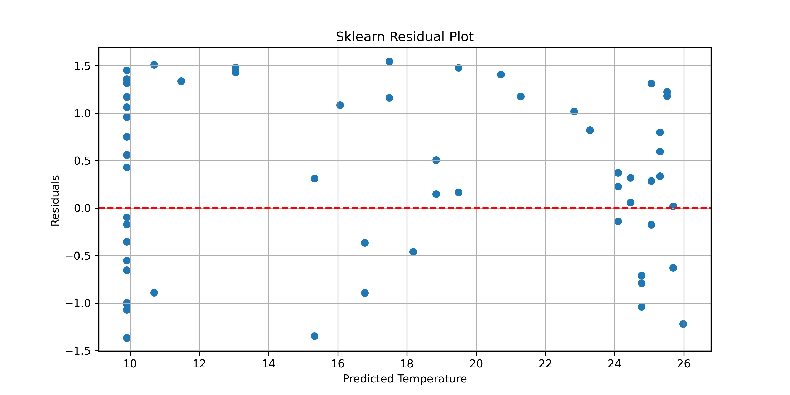

# Synthetic Solar Data Pipeline (Python)

## Overview

This project is a progressive data science and machine learning pipeline designed to simulate and analyse environmental systems using Python.

It focuses on building a solar irradiance → temperature modelling system and developing it from a physics-based simulation into a machine learning regression pipeline.

The system combines:

synthetic data generation
manual linear regression
statistical evaluation
residual analysis
structured pipeline design
early-stage machine learning workflow development

The goal is to move from raw Python scripting toward a modular, reusable scientific computing and ML pipeline.

## Project Structure (Current State)

### Solar Data Generation System

The system generates synthetic environmental data based on:

hour of day (solar position)
month of year (seasonal variation)
sinusoidal irradiance model
linear temperature response model

## Key Physical Relationships
 
### Irradiance Model

Irradiance depends on:

time of day (solar angle)
seasonal scaling (month)

This produces a sinusoidal daily energy curve.

### Temperature Model

Temperature depends on irradiance:

linear approximation of physical response
controlled noise-free relationship (current stage)

## Data Structure

Each generated record follows:

{
    "day": int,
    "hour": int,
    "irradiance": float,
    "temperature": float
}

## Feature Extraction

Regression variables:

X (input) → irradiance
y (target) → temperature

Extracted using:

x_values, y_values = extract_regression_variables(dataset)

## Linear Regression (Manual Implementation)

A full least-squares regression model is implemented from scratch:

slope (m)
intercept (b)

Model:

T= mI + b

Where:

I = irradiance
T = temperature

Expected approximate values:

slope ≈ 0.02
intercept ≈ 10 

## Model Evaluation

The model is evaluated using:

### Mean Squared Error (MSE)

Measures average squared prediction error.

### Root Mean Squared Error (RMSE)

Interpretable error in original temperature units.

Expected result in current deterministic system:

MSE ≈ 0
RMSE ≈ 0

## Residual Analysis

Residuals are computed as:

residual=y− y^
	​
Used to:

validate model correctness
confirm linearity
detect systematic errors
verify pipeline implementation

Expected behaviour:

random scatter around 0
no structured pattern (ideal case)

## Visualisations

### Seasonal Irradiance Curves

demonstrates solar variation across months
shows seasonal scaling effects

### Regression Plot

observed data points
fitted regression line

### Residual Plot

residuals vs input
horizontal reference line at y = 0

## Key Concepts Learned

### Programming Skills

modular function design
reusable pipeline structure
dictionary-based outputs
data extraction patterns

### Data Science Foundations

feature/target separation
synthetic dataset generation
regression modelling from scratch
error metrics (MSE, RMSE)
residual diagnostics

### Physical Modelling

sinusoidal solar irradiance
seasonal scaling effects
simplified temperature response system

## Pipeline Architecture

Data Generation
→ Feature Extraction
→ Linear Regression (manual)
→ Prediction
→ Evaluation (MSE / RMSE)
→ Residual Analysis
→ Visualisation

## Current Limitations

This system is currently:

fully deterministic
noise-free
perfectly linear

This is intentional to:

validate regression correctness
verify pipeline structure
ensure mathematical consistency

## Current Machine Learning Components

The system now includes a full introductory machine learning regression pipeline using scikit-learn.

### Implemented Features

scikit-learn Linear Regression model
train/test split for evaluation
model training on training dataset only
prediction on unseen test data
comparison with manual regression model
evaluation using:
    MSE (Mean Squared Error)
    RMSE (Root Mean Squared Error)

### Model Behaviour

The sklearn model closely matches the manually implemented regression:

similar slope values
similar intercept values
near-identical prediction curves
small numerical differences due to optimisation method

This confirms that:

manual implementation is correct
ML library implementation behaves as expected
pipeline structure is valid

## Updated Pipeline Architecture

Data Generation
→ Feature Extraction
→ Train/Test Split
→ Model Training (scikit-learn)
→ Prediction (test set)
→ Evaluation (MSE / RMSE)
→ Comparison with manual regression
→ Residual Analysis
→ Visualisation

## Next Stage Development

The system will evolve toward more realistic environmental modelling:

### Planned Enhancements

noise injection (cloud variability, measurement error)
asymmetric daylight curves (realistic sunrise/sunset effects)
seasonal daylight length variation
temperature lag effects (thermal inertia)
more complex nonlinear models
transition to classification tasks
multi-dataset integration (solar + air quality comparison)